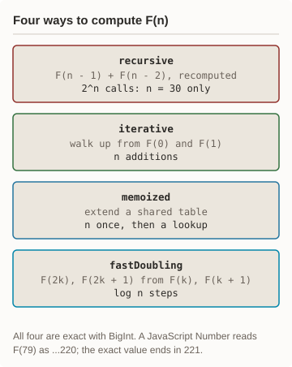
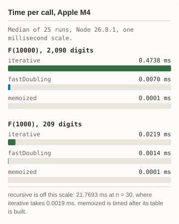
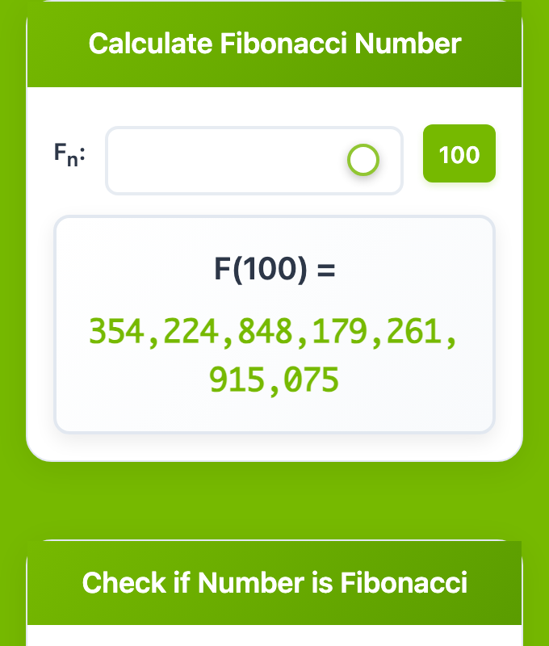
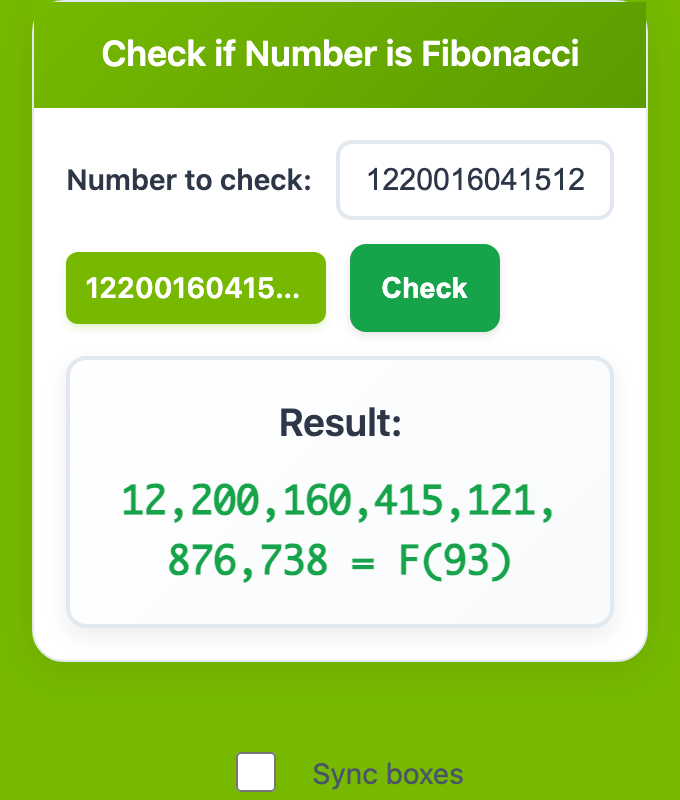

# Fibonacci Calculator

[](https://github.com/frankbesch/fibonacci-calculator/actions/workflows/test.yml)
[](LICENSE)

Exact Fibonacci numbers at any position, in the browser and on the command
line. Every result is a BigInt, so F(1000) comes back with all 209 digits.
A plain JavaScript Number is exact only to 2^53 and reads F(79) one short.
Four methods sit side by side, from the textbook recursion to fast
doubling, with measured times.

Live: [frankbesch.github.io/fibonacci-calculator](https://frankbesch.github.io/fibonacci-calculator/)

## Status

Version 2026.10.3. 11 tests pass on Node 22 and 24 (`npm test`), including
exact F(79), F(100), and F(1000) against values computed independently in
Python. No dependencies. The web app is static files on GitHub Pages; the
CLI needs Node 22 or later.

## Measured results

<p align="center"><picture><source media="(prefers-color-scheme: dark)" srcset="docs/diagrams/methods-dark.svg"/></picture> <picture><source media="(prefers-color-scheme: dark)" srcset="docs/diagrams/times-dark.svg"/></picture></p>

<details><summary>Text version of the diagrams</summary>

Four methods, all exact with BigInt. `recursive` adds F(n - 1) and F(n - 2)
and recomputes both, about 2^n calls, so it runs only for small n.
`iterative` walks up from F(0) and F(1) in n additions. `memoized` extends a
shared table once, then looks values up. `fastDoubling` builds F(2k) and
F(2k + 1) from F(k) and F(k + 1), in about log n steps.

Median time per call on an Apple M4, Node 26.8.1, 25 runs after 5 warm-up
runs. F(10000): iterative 0.4738 ms, fastDoubling 0.0070 ms, memoized
0.0001 ms. F(1000): iterative 0.0219 ms, fastDoubling 0.0014 ms, memoized
0.0001 ms. At n = 30, recursive takes 21.7693 ms and iterative 0.0019 ms.
memoized is timed after its table is built.

</details>

The receipt is
[docs/runs/2026-10-03-methods.txt](docs/runs/2026-10-03-methods.txt), from
`npm run bench`.

## How it works

<p align="center"><picture><source media="(prefers-color-scheme: dark)" srcset="docs/screens/calculator.png"/></picture> <picture><source media="(prefers-color-scheme: dark)" srcset="docs/screens/checker.png"/></picture></p>

The web app at phone width. Left, the slider at 100 shows F(100) =
354,224,848,179,261,915,075, every digit exact. Right, the checker confirms
12,200,160,415,121,876,738 is F(93), a value past 2^53 that a plain
JavaScript Number cannot hold exactly. The page has no dark mode, so both
themes show the same captures.

- `fibonacci.js` is the core. It loads as a browser script and as a Node
  module, and every method returns a BigInt.
- **Methods:** `iterative` (the default), `fastDoubling`, `memoized`
  (`memorized` still works), and `recursive`.
- **Checks:** `isFibonacci(x)` tests whether 5x² + 4 or 5x² − 4 is a
  perfect square, with an exact integer square root, so it works past 2^53.
  `findPosition(x)` returns n or null.
- **Also:** `sequence(count)`, `goldenRatio(n)` (finite for large n), and
  `format(x)` for thousands separators.
- `index.html` and `app.js` are the web app: a slider for F(n) up to 100
  and a checker that takes any number of digits. No third-party requests.
- `cli.js` is the command line, one-shot or interactive.

## Quick start

```bash
# Get the code. No install step.
git clone https://github.com/\
frankbesch/fibonacci-calculator.git
cd fibonacci-calculator

# F(100), digits only.
node cli.js 100

# One command, then exit.
node cli.js calc 1000 fast
node cli.js check 12200160415121876738

# The prompt; type "help".
node cli.js

# The tests.
npm test
```

Open `index.html` in a browser for the web app, or serve the folder with
`deployments/1-local/run-local.sh`.

## Measured run

```bash
# Time every method on this machine.
npm run bench
```

It prints the Node version and CPU, then the median of 25 timed calls per
method at n = 30, 1000, and 10000, and stops if any method disagrees with
`iterative`. Times vary by machine; the receipt above is one run.

## Known gaps

- `recursive` is exponential: the CLI caps it at n = 35 and the page at
  n = 30.
- The web app's GPU section shows modelled estimates, not measurements.
- `memoized` keeps every value it has computed for the life of the process.

## More

- [docs/runs/](docs/runs/): the timing receipt.
- [deployments/1-local](deployments/1-local/README.md): run the page from a
  local server.

## License

MIT. See [LICENSE](LICENSE).
